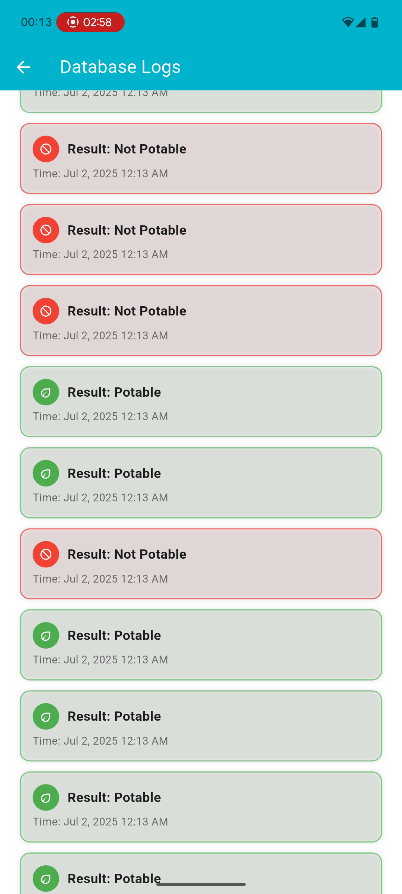
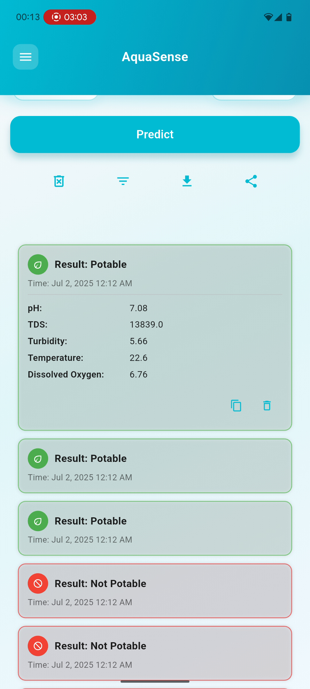

# AquaSense: Smart Water Quality Monitoring & Prediction App

<p align="center">
  
  <br>
  <span style="font-size: 14px; color: gray;"><b>This app is designed to operate on live streaming sensor data</b></span>
</p>

## 🎬 Full Demo

<p align="center">
  <a href="https://youtube.com/watch?v=your-demo-video-id">
    
  </a>
  <br>
  <span style="font-size: 14px; color: gray;"><b>👆 Click to watch the complete demo on YouTube</b></span>
</p>

---

## 📋 Overview

**AquaSense** is a comprehensive full-stack IoT solution that combines real-time water quality monitoring with machine learning-powered predictions. The system integrates hardware sensors, AWS IoT infrastructure, and a Flutter mobile application to provide instant water potability assessments with an intuitive, user-friendly interface.

The platform is designed for environmental monitoring, water quality management, and educational purposes, featuring real-time data visualization, trend analysis, and comprehensive logging capabilities.

---

## 🏗️ System Architecture

### Core Components

**AquaSense** consists of three integrated layers:

1. **ML Model Training & Optimization**
   - XGBoost-based water quality prediction model
   - Feature engineering and hyperparameter tuning
   - Model persistence with joblib serialization

2. **Backend Infrastructure** 
   - FastAPI REST API for model inference
   - PostgreSQL database hosted on Railway
   - Real-time logging and data persistence

3. **Flutter Mobile Application**
   - Cross-platform iOS/Android compatibility
   - Real-time AWS MQTT integration
   - Interactive data visualization and user interface

---

## ✨ Key Features

### 🌊 Real-time Monitoring
- **5 Water Quality Parameters**: pH, TDS, Turbidity, Temperature, Dissolved Oxygen
- **AWS IoT Integration**: Secure MQTT communication with hardware sensors
- **Live Data Updates**: Instant display of sensor readings with trend indicators

### 🤖 AI-Powered Predictions
- **Machine Learning Classification**: XGBoost model predicts water potability
- **Instant Results**:  **Potable** or  **Not Potable** classifications
- **Error Handling**:  Graceful error management and user feedback

### 📊 Interactive Visualizations
- **Dynamic Graphs**: Scrollable, zoomable time-series data
- **Expandable Tiles**: Detailed parameter analysis with historical trends
- **Real-time Updates**: Live chart updates as new data arrives

### 📱 User Experience
- **Intuitive Interface**: Clean, modern material design
- **Responsive Layout**: Optimized for various screen sizes
- **Accessibility**: High contrast colors and clear navigation

---

## 🎯 Application Features

### 1. Splash Screen & App Launch

<p align="center">
  
  <br>
  <span style="font-size: 12px; color: gray;"><b>Animated splash screen with VIT Chennai branding</b></span>
</p>

**Features:**
- Elegant Lottie animation background
- VIT Chennai university logo integration
- Smooth transition to main interface
- Interactive START button with haptic feedback

### 2. Home Screen & Sensor Dashboard

<div align="center">
  
  
  <br>
  <span style="font-size: 12px; color: gray;"><b>Main dashboard with real-time sensor data and trend visualization</b></span>
</div>

**Core Functionality:**
- **5 Parameter Tiles**: pH, TDS, Turbidity, Temperature, Dissolved Oxygen
- **Real-time Updates**: Live sensor data via AWS MQTT
- **Trend Indicators**: Mini-charts showing parameter history
- **Central Predict Button**: Triggers ML inference workflow

### 3. Prediction Results & Classification

<div align="center">
  
  
  <br>
  <span style="font-size: 12px; color: gray;"><b>AI-powered water quality predictions with visual feedback</b></span>
</div>

**Prediction System:**
- **Loading Animation**: Smooth prediction processing indicator
- **Color-coded Results**: Green for potable, red for not potable, orange for errors
- **Instant Feedback**: Results appear immediately after inference
- **Result Logging**: All predictions stored for historical analysis

### 4. Interactive Data Visualization

<div align="center">
  
  
  
  <br>
  <span style="font-size: 12px; color: gray;"><b>Advanced graph interactions: maximize, zoom, pan, and switch between parameters</b></span>
</div>

**Graph Features:**
- **Expandable Views**: Tap any tile to view detailed historical data
- **Interactive Charts**: Pinch to zoom, pan to scroll through time
- **Multi-parameter Analysis**: Switch between different sensor parameters
- **Timestamp Tooltips**: Precise data point information on tap

### 5. Navigation & Menu System

<div align="center">
  
  
  <br>
  <span style="font-size: 12px; color: gray;"><b>Comprehensive sidebar navigation with connection status and app info</b></span>
</div>

**Menu Options:**
- **Log Management**: View, download, share session data
- **Connection Status**: Real-time AWS and backend connectivity indicators
- **App Information**: Version details and developer credits
- **External Links**: Direct access to institutional websites

### 6. Comprehensive Log Management

<div align="center">
  
  
  
  <br>
  <span style="font-size: 12px; color: gray;"><b>Advanced log management with filtering, sharing, and detailed view options</b></span>
</div>

<div align="center">
  
  
  
  <br>
  <span style="font-size: 12px; color: gray;"><b>Export, share, and manage prediction logs with multiple format options</b></span>
</div>

**Log Features:**
- **Smart Filtering**:  Filter by result type (All, Potable, Not Potable, Error)
- **Data Export**:  Download logs as JSON files
- **Native Sharing**: Share logs via email, messaging, cloud storage
- **Expandable Entries**: Detailed view of individual predictions with copy functionality

### 7. Convenience & Accessibility

<div align="center">
  
  <br>
  <span style="font-size: 12px; color: gray;"><b>Quick access to institutional websites through branding elements</b></span>
</div>

**User Experience Enhancements:**
- **External Integration**: Tap university logo to visit official website
- **Responsive Design**: Optimized for various screen sizes and orientations
- **Error Handling**: Comprehensive error states with clear user feedback
- **Performance Optimization**: Smooth animations and efficient data handling

---

## ⚙️ Technical Implementation

### Backend Architecture

| Component                    | Technology        |
|-----------------------------|-------------------|
| **API Framework**           | FastAPI           |
| **Database**                | PostgreSQL        |
| **Hosting Platform**        | Railway           |
| **ML Model**                | XGBoost           |
| **Model Serialization**     | joblib            |

### Mobile Application

| Component                    | Technology        |
|-----------------------------|-------------------|
| **Framework**               | Flutter/Dart      |
| **State Management**        | StatefulWidget    |
| **Charting Library**        | FL Chart          |
| **IoT Communication**       | MQTT Client       |
| **File Operations**         | File Picker       |

### IoT Infrastructure

| Component                    | Technology        |
|-----------------------------|-------------------|
| **Cloud Platform**          | AWS IoT Core      |
| **Communication Protocol**  | MQTT over TLS     |
| **Security**                | X.509 Certificates|
| **Data Format**             | JSON              |

---

## 📊 Model Performance

| Metric                      | Value             |
|-----------------------------|-------------------|
| **Algorithm**               | XGBoost Classifier|
| **Training Accuracy**       | ~94%              |
| **Cross-validation Score**  | ~92%              |
| **Inference Time**          | <100ms            |
| **Model Size**              | ~500KB            |

**Features Used:**
- pH level (optimal range: 6.5-8.5)
- Total Dissolved Solids (TDS)
- Turbidity (water clarity)
- Temperature
- Dissolved Oxygen content

---

## 🔧 Installation & Setup

### Prerequisites

```bash
# Flutter SDK (latest stable)
flutter --version

# Python 3.8+
python --version

# PostgreSQL database access
```

### Backend Setup

```bash
# Navigate to backend directory
cd backend/

# Install Python dependencies
pip install -r requirements.txt

# Set environment variables
export DATABASE_URL="your-postgresql-url"

# Run development server
uvicorn app.main:app --reload
```

### Mobile App Setup

```bash
# Install Flutter dependencies
flutter pub get

# Configure AWS IoT certificates
# Add your certificates to assets/aws/

# Run on device/simulator
flutter run
```

### Database Setup

```sql
-- PostgreSQL table creation
CREATE TABLE IF NOT EXISTS logs (
    timestamp TEXT,
    inputs JSONB,
    result TEXT
);
```

---

## 📁 Repository Structure

```
📂 AquaSense/
│
├── 📁 assets/              # App resources and icons
│   ├── 📁 fonts/          # Custom typography
│   ├── 🎨 *.svg           # Vector icons for UI
│   ├── 🖼️ *.png           # Logos and branding
│   └── 🎬 *.json          # Lottie animations
│
├── 📁 backend/             # FastAPI backend service
│   ├── 📁 app/            # Application modules
│   │   ├── 🐍 db.py       # Database operations
│   │   ├── 🐍 main.py     # FastAPI application
│   │   ├── 🐍 model.py    # ML model inference
│   │   └── 🐍 logs.py     # Log management API
│   ├── 📁 model/          # Trained ML models
│   └── 📄 requirements.txt # Python dependencies
│
├── 📁 lib/                # Flutter application code
│   ├── 📁 screens/        # App screens/pages
│   ├── 📁 widgets/        # Reusable UI components
│   └── 🎯 main.dart      # App entry point
│
├── 📁 images/             # Documentation screenshots
└── 📄 README.md          # Project documentation
```

---
